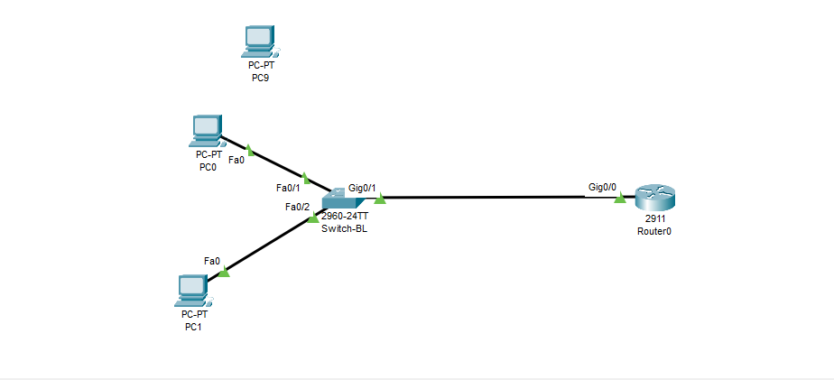

# Cisco IOS Osnovna Konfiguracija i Port Security (Lab Vežba)

Ovaj repozitorijum sadrži praktičnu vježbu iz Cisco IOS konfiguracije switcha i rutera kreiranu u alatu **Cisco Packet Tracer**. Fokus vježbe je na optimizaciji CLI okruženja, implementaciji SSH udaljenog pristupa i osiguravanju portova kroz Port Security funkciju.

## 🏗️ Mrežna Topologija



## Adresni Plan (IP Addressing Table)

| Uređaj | Interfejs | IP Adresa | Subnet Mask | Default Gateway | Svrha / Opis |
| :--- | :--- | :--- | :--- | :--- | :--- |
| **Ruter-BL** | Gig0/0/0 | 192.168.1.1 | 255.255.255.0 | N/A | Default Gateway za LAN |
| **Switch-BL** | VLAN 1 (SVI) | 192.168.1.2 | 255.255.255.0 | 192.168.1.1 | Upravljački interfejs za SSH |
| **PC-0** | Fa0 | 192.168.1.10 | 255.255.255.0 | 192.168.1.1 | Administrator (Dozvoljen port) |
| **PC-1** | Fa0 | 192.168.1.20 | 255.255.255.0 | 192.168.1.1 | Testni računar (Gost/Uljez) |

## Implementirane Tehnologije i Bezbjednost

### 1. Osnovno podešavanje i optimizacija CLI
- Promijenjena fabrička imena uređaja (`hostname`).
- Postavljena kriptovana lozinka za privilegovani mod (`enable secret`).
- Isključeno pretraživanje nepostojećih komandi preko DNS-a (`no ip domain-lookup`).
- Aktivirana sinhronizacija sistemskih poruka kako logovi ne bi prekidali kucanje (`logging synchronous`).

### 2. Zaštita udaljenog pristupa (SSH v2)
- Konfigurisan naziv domene (`ip domain-name banka.local`) i generisan RSA ključ dužine **1024 bita**.
- Kreiran lokalni administratorski nalog sa najvišim nivoom privilegija (`privilege 15`).
- Na VTY linijama (0-4) striktno zabranjen nesigurni Telnet i dozvoljen isključivo SSH (`transport input ssh`), uz autentifikaciju kroz lokalnu bazu podataka (`login local`).

### 3. Sigurnost portova (Port Security)
- Port **Fa0/1** (Admin) prebačen u `access` mod i zaključan na maksimalno **1 MAC adresu**.
- Aktiviran `sticky` mehanizam za dinamičko učenje i trajno "lijepljenje" MAC adrese u tekuću konfiguraciju.
- Postavljena kaznena politika na `shutdown`, što znači da će switch automatski ugasiti port i prebaciti ga u `err-disabled` stanje ukoliko se otkrije neovlaštena MAC adresa.
- Svi nekorišteni portovi na switchu (Fa0/3 - Fa0/24) su ručno ugašeni (`shutdown`).

## Kako pokrenuti lab?

1. Preuzmite fajl `cisco-osnovna-konfiguracija.pkt` iz ovog repozitorijuma.
2. Otvorite ga u programu **Cisco Packet Tracer**.
3. Za testiranje SSH pristupa sa PC-0, otvorite Command Prompt i ukucajte:
   ```bash
   ssh -l admin 192.168.1.2
